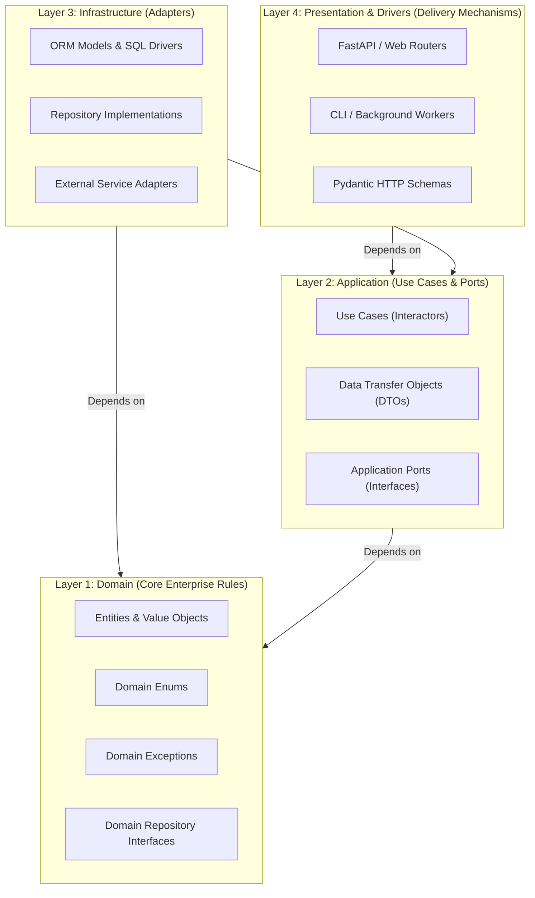
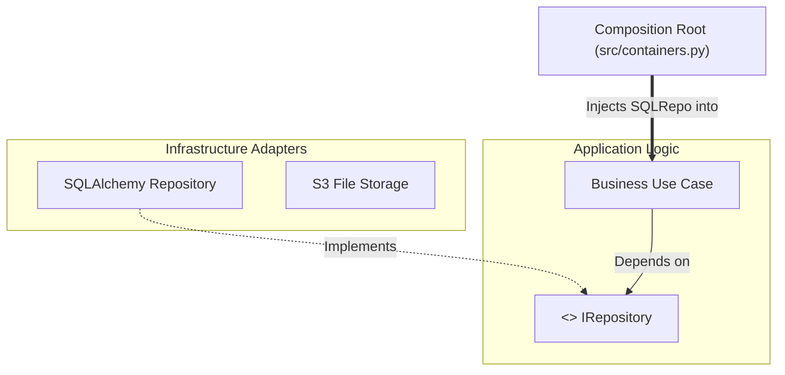

# Clean Architecture: Principles & Blueprint

This document provides a comprehensive, domain-agnostic technical reference on **Clean Architecture**, its theoretical foundations, structural invariants, layer boundaries, and implementation principles in modern Python applications.

---

## 1. Architectural Philosophy

Clean Architecture (formulated by Robert C. Martin, building upon Hexagonal/Ports & Adapters and Onion Architectures) is an architectural pattern designed to achieve **high cohesion and loose coupling**.

Its fundamental objective is to make the application:

1. **Independent of Frameworks**: Frameworks (FastAPI, Django, Flask) are treated as delivery mechanisms and implementation details, not the foundation of your system.
2. **Testable**: Business logic can be tested in complete isolation without running a web server, database, message broker, or external service.
3. **Independent of the UI**: The presentation layer can change (e.g., REST API to CLI, GraphQL, or gRPC) without altering business logic.
4. **Independent of the Database**: Persistence technologies (SQLAlchemy, PostgreSQL, MSSQL, Mongo, Qdrant) can be swapped or modified without affecting domain rules.
5. **Independent of External Agencies**: The core business rules have zero awareness of external APIs, third-party libraries, or vendor SDKs.

---

## 2. The Golden Rule: The Dependency Rule

> **Source code dependencies must point strictly INWARD toward higher-level policies (the Domain).**

Nothing in an inner circle can know anything at all about something in an outer circle. This includes functions, classes, variables, frameworks, or any external data formats.



---

## 3. The Four Concentric Layers

```
  ┌────────────────────────────────────────────────────────────────────────┐
  │ 4. PRESENTATION (Routers, Controllers, Request/Response Schemas)      │
  │   ┌──────────────────────────────────────────────────────────────────┐ │
  │   │ 3. INFRASTRUCTURE (SQLAlchemy, Drivers, External APIs, Repos)    │ │
  │   │   ┌────────────────────────────────────────────────────────────┐ │ │
  │   │   │ 2. APPLICATION (Use Cases, DTOs, Port Interfaces)          │ │ │
  │   │   │   ┌──────────────────────────────────────────────────────┐ │ │ │
  │   │   │   │ 1. DOMAIN (Entities, Value Objects, Domain Enums)   │ │ │ │
  │   │   │   └──────────────────────────────────────────────────────┘ │ │ │
  │   │   └────────────────────────────────────────────────────────────┘ │ │
  │   └──────────────────────────────────────────────────────────────────┘ │
  └────────────────────────────────────────────────────────────────────────┘
```

### Layer 1: Domain Layer (`src/domain/`)

- **Definition**: Contains the most fundamental, timeless business rules, core entities, invariants, and business domain exceptions.
- **Invariants & Constraints**:
  - **Zero External Dependencies**: Must NOT import FastAPI, SQLAlchemy, Pydantic, HTTP libraries, or third-party SDKs.
  - Uses pure standard Python types (`dataclass`, `Enum`, primitive types).
- **Codebase Mapping**:
  - `src/domain/entities.py`: Core business entities and value objects.
  - `src/domain/enums.py`: Domain enumeration constants.
  - `src/domain/exceptions.py`: Business rule violation exceptions.
  - `src/domain/interfaces/`: Abstract contracts for domain entity persistence.

### Layer 2: Application Layer (`src/application/`)

- **Definition**: Orchestrates the flow of data to and from the domain entities, directing those entities to apply their business rules to achieve the goals of the use case.
- **Invariants & Constraints**:
  - Knows **only** the Domain layer.
  - Does **NOT** know how data is transported (HTTP, CLI, WebSockets) or stored (SQL, NoSQL, Vector DB).
- **Codebase Mapping**:
  - `src/application/use_cases/`: Single-responsibility workflow classes implementing an `execute()` method.
  - `src/application/dtos.py`: Data Transfer Objects that cross boundaries into and out of use cases.
  - `src/application/interfaces/`: Application Ports defining technical contracts required by use cases.

### Layer 3: Infrastructure Layer (`src/infrastructure/`)

- **Definition**: Contains all concrete technical implementations, database access logic, third-party API clients, and device drivers.
- **Invariants & Constraints**:
  - Implements the abstract interfaces (Ports) declared in the Domain and Application layers.
  - Bridges external technical formats to internal domain/application types.
- **Codebase Mapping**:
  - `src/infrastructure/configs/settings.py`: Pydantic `BaseSettings` reading environment variables.
  - `src/infrastructure/db/`: Database engine, session factories (`session.py`), `base.py`, and ORM models (`models/`).
  - `src/infrastructure/db/repositories/`: Concrete repository implementations querying databases and returning Domain Entities.
  - `src/infrastructure/services/`: Concrete adapters for third-party tools, AI models, file parsers, and external APIs.
  - `src/infrastructure/utils.py`: Infrastructure-specific helpers and utilities.

### Layer 4: Presentation Layer (`src/presentation/`)

- **Definition**: The interface between the external world (HTTP clients, web browsers, background cron tasks) and the application.
- **Invariants & Constraints**:
  - Validates external input format, handles serialization/deserialization, authentication, and HTTP status codes.
  - Never contains business logic; delegates directly to Application use cases.
- **Codebase Mapping**:
  - `src/presentation/routers/`: FastAPI endpoints receiving incoming HTTP requests.
  - `src/presentation/schemas/`: Framework-specific data validation models (Pydantic request/response schemas).
  - `src/presentation/security.py`: Authentication, API key, and authorization dependencies.
  - `src/presentation/lifespan.py`: Startup and shutdown hooks, database warm-up, and DI container wiring.

---

## 4. Codebase Directory Mapping Summary

Here is how the entire scaffolded codebase directly corresponds to Clean Architecture:

```
src/
├── domain/                  <── [Layer 1: Enterprise Business Rules]
│   ├── entities.py
│   ├── enums.py
│   ├── exceptions.py
│   └── interfaces/
│
├── application/             <── [Layer 2: Application Business Rules]
│   ├── dtos.py
│   ├── interfaces/
│   └── use_cases/
│
├── infrastructure/          <── [Layer 3: Interface Adapters & Frameworks]
│   ├── configs/
│   ├── db/
│   │   ├── base.py
│   │   ├── session.py
│   │   ├── models/
│   │   └── repositories/
│   ├── services/
│   └── utils.py
│
├── presentation/            <── [Layer 4: Delivery Mechanism / UI]
│   ├── lifespan.py
│   ├── security.py
│   ├── routers/
│   ├── schemas/
│   └── static/
│
├── containers.py            <── [Composition Root: Glues Layer 2, 3 & 4 via DI]
├── main.py                  <── [Application Entry Point (FastAPI HTTP Server)]
└── worker.py                <── [Background Worker Entry Point (Async Task Runner)]
```

---

## 4. Inversion of Control & The Composition Root

### The Dependency Inversion Principle (DIP)

In traditional procedural architectures, high-level business logic depends directly on low-level database queries or HTTP clients.

Clean Architecture **inverts** this dependency using interfaces:

```
Traditional Flow (Coupled):
[ Use Case ] ──────────────► [ Concrete Postgres Repository ]

Clean Architecture Flow (Inverted):
[ Use Case ] ──► [ IRepository (Port) ] ◄── [ PostgresRepository (Adapter) ]
  (Application)        (Domain/Application)              (Infrastructure)
```

### The Composition Root Pattern

Because the Application layer only knows abstract interfaces, an external component must assemble and wire the concrete adapters to the use cases at application startup. This single assembly point is known as the **Composition Root** (implemented via `src/containers.py` using `dependency-injector`).



---

## 5. Cross-Boundary Data Flow & Mapping Protocol

To prevent outer-layer frameworks from leaking into inner layers, data must be translated as it passes across boundaries:

```
[ HTTP JSON Payload ]
        │
        ▼
[ Presentation Schema (Pydantic) ]
        │  (schema.to_dto())
        ▼
[ Application Request DTO ]
        │
        ▼
[ Use Case (Orchestration) ] ◄──► [ Domain Entity ] (Core Invariants)
        │                                ▲
        ▼                                │ (mapper.to_domain())
[ Repository Interface ]                 │
        │                                ▼
[ Concrete Repository Adapter ] ◄──► [ ORM Table Model ] ◄──► [ SQL Database ]
        │
        ▼
[ Application Result DTO ]
        │  (Schema.from_dto())
        ▼
[ Presentation Response Schema ]
        │
        ▼
[ HTTP 200 JSON Response ]
```

---

## 6. The Testing Pyramid in Clean Architecture

Clean Architecture makes testing straightforward, fast, and deterministic:

```
         / \
        / E2E \       <-- Tests entire HTTP flow with test client (FastAPI TestClient)
       /───────\
      /  Integ  \     <-- Tests Infrastructure Repositories against real DB/Docker
     /───────────\
    /    Unit     \   <-- Tests Use Cases & Domain with 100% mocked Ports (Fastest)
   /───────────────\
```

1. **Unit Tests (`tests/unit/`)**:
   - Test pure Domain rules and Application use cases.
   - **Rule**: Zero database, zero network calls, zero file I/O. All Ports are substituted with test doubles/mocks (`AsyncMock`).
2. **Integration Tests (`tests/integration/`)**:
   - Test Infrastructure adapters (SQLAlchemy repositories, caching layers) against real test database containers.
   - Verify that SQL queries, mappings, and transaction rollbacks execute properly.
3. **End-to-End Tests (`tests/e2e/`)**:
   - Test full HTTP requests through Presentation routers to verify serialization, status codes, and security.

---

## 7. Common Anti-Patterns to Avoid

| Anti-Pattern              | Description                                                                                                                | Clean Architecture Remedy                                                                             |
| :------------------------ | :------------------------------------------------------------------------------------------------------------------------- | :---------------------------------------------------------------------------------------------------- |
| **Domain Pollution**      | Importing FastAPI, SQLAlchemy, or Pydantic inside `src/domain/`.                                                           | Keep Domain strictly pure Python standard library.                                                    |
| **Leaking ORM Models**    | Returning SQLAlchemy ORM models from Repositories directly to Use Cases or Routers.                                        | Always map ORM models to pure Domain Entities inside the Repository adapter before returning.         |
| **Bypassing Use Cases**   | Calling Repositories or Database sessions directly from API Routers.                                                       | API Routers must only interact with Application Use Cases.                                            |
| **God Container**         | A massive single container file with hundreds of unorganized providers.                                                    | Use the Modular Sub-Containers pattern (Core, Gateways, Services, Repositories, Use Cases).           |
| **Premature Abstraction** | Creating abstract interfaces for internal helper functions that will never have alternate implementations or need mocking. | Only create interfaces (Ports) at true architectural boundaries (I/O, persistence, third-party APIs). |
