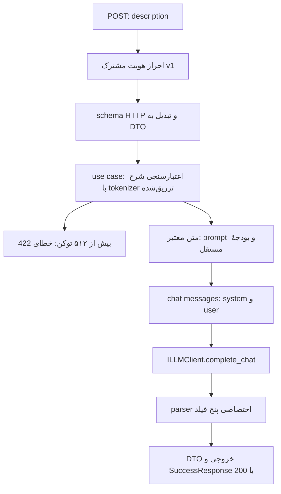

# استانداردهای موجود پروژه برای endpoint ساختاربندی ایده

تاریخ بررسی: **۲۰۲۶-۱۰-۰۷**. مبنا: کد و مستندات موجود در working tree، با HEAD برابر `dce346a`. این سند برای آماده‌سازی پیاده‌سازی نوشته شده است؛ endpoint جدید هنوز پیاده‌سازی نشده است.

نیاز مورد بررسی: دریافت یک شرح ایده، با حداکثر **۵۱۲ توکن**، و تولید پنج فیلد قابل استخراج: **عنوان، مسئلهٔ فعلی، راهکار، مزیت و عیب**.

## ۱. اعتبار یافته‌ها و وضعیت واقعی پروژه

در این سند چهار نوع گزاره از هم جدا شده‌اند:

| برچسب | معنی |
|---|---|
| **کد تأییدشده** | رفتار یا ساختاری که مستقیماً در کد فعلی دیده شده است؛ الزاماً در این بررسی اجرا نشده است. |
| **قرارداد مستند** | قاعدهٔ اعلام‌شده در مستندات یا `AGENTS.md`؛ ممکن است کد هنوز دقیقاً مطابق آن نباشد. |
| **پیشنهاد** | نتیجهٔ این بررسی برای endpoint جدید؛ رفتار موجود پروژه محسوب نمی‌شود. |
| **خلأ یا ناسازگاری** | موضوعی که استاندارد روشن ندارد، یا کد و مستندات دربارهٔ آن متفاوت‌اند. |

**کد تأییدشده:** پروژهٔ فعلی دارای FastAPI app، router، schema، احراز هویت، use case، DI و تست است. توصیف scaffold اولیه در `AGENTS.md` که این اجزا را خالی معرفی می‌کند، دربارهٔ وضعیت فعلی صحیح نیست. محدودیت‌های مالکیت و سیاست DI آن همچنان باید رعایت شوند.

**کد تأییدشده:** مسیر واقعی `Suggestion Analyze` در صورت باقی‌ماندن شواهد معتبر، زنجیرهٔ Generation را اجرا می‌کند و پاسخ مدل را برمی‌گرداند. بنابراین این مسیر مرجع مناسبی برای معماری HTTP و اتصال Generation است. مستنداتی که می‌گویند `analysis` فقط پرامپت است، با کد فعلی همخوان نیستند.

**حدود بررسی:** فایل‌های مرتبط و منابع تست‌ها خوانده شدند؛ درخواست زنده به LLM، پایگاه داده یا سرویس خارجی ارسال نشد. نتیجهٔ اجرای محدود تست‌ها در بخش ۱۳ آمده است. هیچ تغییری در کد تولید، تست‌ها، تنظیمات یا مستندات قبلی انجام نشد.

مراجع: [ساخت app](../../src/main.py#L34)، [فراخوانی Generation در Analyze](../../src/application/use_cases/analyze_suggestion_use_case.py#L217)، [composition root](../../src/containers.py#L523).

## ۲. مسیرهای HTTP موجود و الگوی URL

**کد تأییدشده:** router اصلی prefix برابر `/api/v1` دارد. مسیرهای عملیاتی پیشنهادها در router جداگانه با tag برابر `Suggestions` ثبت می‌شوند. نام منبع جمع است و عملیات خاص پس از نام منبع می‌آیند.

| روش | مسیر کامل | پاسخ موفق / نتیجه | کاربرد |
|---|---|---|---|
| `POST` | `/api/v1/suggestions/analyze` | `200` | تحلیل هم‌زمان پیشنهاد با بازیابی شواهد و Generation |
| `POST` | `/api/v1/suggestions/ingest` | `201` | ورود پیشنهاد |
| `PUT` | `/api/v1/suggestions/{suggestionId}` | `200` | جایگزینی کامل |
| `PATCH` | `/api/v1/suggestions/{suggestionId}` | `200` | تغییر جزئی |
| `DELETE` | `/api/v1/suggestions/{suggestionId}` | `200` | حذف پیشنهاد |
| `POST` | `/api/v1/suggestions/bulk-delete` | `200`، `207` یا `400` | موفقیت کامل، موفقیت جزئی یا شکست کامل دسته |

برای پارامتر مسیر، نام بیرونی `suggestionId` به نام داخلی `suggestion_id` نگاشت می‌شود؛ طول آن در router بین ۱ و ۱۲۸ کاراکتر است.

`/` و `/health` مسیرهای میزبان هستند و JSON ساده برمی‌گردانند؛ زیر router محافظت‌شدهٔ v1 نیستند. `/docs`، `/openapi.json` و `/scalar` برای مستندات هستند. `/api/v1/mock/reset` فقط در حالت mock اضافه می‌شود. قالب پاسخ endpointهای عملیاتی را از `/health` یا مسیرهای mock-admin استخراج نکنید.

**پیشنهاد:** endpoint ایده نیز `POST` و هم‌زمان باشد و پاسخ نهایی را با `200` برگرداند. نام پیشنهادی، مطابق الگوی منبع + عملیات، **`/api/v1/suggestions/expand-suggestion`** است. این URL در پروژه وجود ندارد و انتخاب نهایی آن یک تصمیم API است. برای عملیاتی که چیزی ذخیره نمی‌کند، الگوی `201` مربوط به ingest کاربرد ندارد.

مراجع: [router اصلی و پاسخ‌های مشترک](../../src/presentation/routers/router.py#L11)، [مسیرهای پیشنهاد](../../src/presentation/routers/v1/suggestion.py#L34)، [مسیرهای میزبان و mock](../../src/main.py#L88).

## ۳. مرجع اصلی: Suggestion Analyze چه کاری می‌کند؟

### ۳.۱. ورودی و اعتبارسنجی

**کد تأییدشده:** بدنهٔ ورودی JSON ساده است و پوشش `data` ندارد:

```json
{
  "title": "بهینه‌سازی مصرف انرژی در شبکه توزیع",
  "currentProblem": "افزایش تلفات تجهیزات در مناطق گرمسیری",
  "solution": "استفاده از تجهیزات کم‌تلفات و پایش مستمر",
  "contextTitle": "معاونت مهندسی و توزیع"
}
```

| فیلد بیرونی | فیلد schema | فیلد application DTO | قواعد فعلی |
|---|---|---|---|
| `title` | `title` | `title` | اجباری، رشته، حذف فاصلهٔ ابتدا/انتها، حداقل ۵ کاراکتر، رد متن بی‌محتوا |
| `currentProblem` | `current_problem` | `problem` | همان قواعد |
| `solution` | `solution` | `solution` | همان قواعد |
| `contextTitle` | `context_title` | `context_title` | اختیاری؛ رشتهٔ خالی به `None` تبدیل می‌شود |

عبارت‌هایی مانند `ندارد` و `بدون شرح` با فهرست `NOISE_PLACEHOLDERS` رد می‌شوند. فیلد اضافه پذیرفته نمی‌شود. schema با `to_dto()` یک `AnalyzeSuggestionDTO` می‌سازد. use case نیز با `SuggestionContent` قواعد دامنه را دوباره اعمال می‌کند و سپس متن فارسی را normalize می‌کند.

**خلأ:** Analyze سقف ۵۱۲ توکن یا سقف طول بالای متن ندارد. حداقل ۵ کاراکتر، قاعدهٔ محتوای پیشنهاد است؛ از آن نمی‌توان حداقل طول مناسب شرح ایده را نتیجه گرفت.

مراجع: [schema و نگاشت DTO](../../src/presentation/schemas/v1/analyze_suggestion_request.py#L14)، [DTO داخلی](../../src/application/dtos.py#L145)، [اعتبارسنجی application](../../src/application/use_cases/analyze_suggestion_use_case.py#L133).

### ۳.۲. مسیر اجرا و استثناهای آن

**کد تأییدشده:** مسیر عادی چنین است:

```text
AnalyzeSuggestionRequest → AnalyzeSuggestionDTO
  → اعتبارسنجی دامنه و normalization
  → retrieval، reranking، pooling و hydration
  → GenerationInput
  → GenerateSuggestionUseCase
  → آماده‌سازی context → ساخت chat messages → LLM → parser
  → AnalyzeSuggestionResponse → schema پاسخ HTTP
```

در `AnalyzeSuggestionUseCase`، dependency اجباری `generator: IGenerateSuggestionUseCase` دریافت می‌شود. در مسیر دارای شواهد، `await self._generator.execute(generation_input)` فراخوانی می‌شود و `generation_result.answer` در `analysis` قرار می‌گیرد.

دو خروج زودهنگام وجود دارد: نبود نتیجهٔ برداری و نبود پیشنهاد فعال و معتبر پس از hydration. هر دو بدون فراخوانی مدل، متن تشخیصی، لیست‌های خالی و توضیح کمبود شواهد برمی‌گردانند.

`isFallbackMode` مربوط به شکست reranker و استفاده از امتیازهای retrieval است؛ نشان‌دهندهٔ اصلاح JSON نامعتبر یا پاسخ جایگزین LLM نیست. خطای LLM یا parser در مسیر عادی به handler مرکزی منتقل می‌شود.

**پیشنهاد:** endpoint ایده، use case مستقلی داشته باشد. `AnalyzeSuggestionUseCase` ورودی از پیش تفکیک‌شده می‌خواهد، retrieval انجام می‌دهد و در نبود سابقه مدل را فراخوانی نمی‌کند؛ این رفتار نیاز «تولید پنج فیلد از یک شرح ایده» را پوشش نمی‌دهد.

مراجع: [dependencyهای Analyze](../../src/application/use_cases/analyze_suggestion_use_case.py#L101)، [خروج بدون hit](../../src/application/use_cases/analyze_suggestion_use_case.py#L164)، [خروج بدون candidate فعال و Generation](../../src/application/use_cases/analyze_suggestion_use_case.py#L209)، [fallback مربوط به reranker](../../src/application/use_cases/analyze_suggestion_use_case.py#L404).

### ۳.۳. خروجی فعلی

**کد تأییدشده:** پاسخ موفق دارای `status: 200` و `data` است. `data` شامل `analysis`، پنج فهرست `similarExecutedIds`، `similarApprovedIds`، `similarPendingIds`، `similarRejectedIds`، `similarNotAcceptedIds`، و نیز `appliedStatuteIds`، `uncertainty`، `citedSuggestionIds`، `isFallbackMode` و `groundingRatio` است.

`analysis` متن Markdown تولیدشده توسط مدل در مسیر عادی است. فهرست‌های وضعیت، پیشنهادهای بازیابی‌شدهٔ معتبر را نشان می‌دهند؛ `citedSuggestionIds` زیرمجموعهٔ منابع ارجاع‌شدهٔ مدل است. `groundingRatio` نسبت تعداد پیشنهادهای استنادشده به کل candidateهای فعال است و confidence مدل محسوب نمی‌شود. `appliedStatuteIds` در این مسیر فعلاً همیشه خالی است.

**پیشنهاد:** خروجی پنج‌فیلدی ایده در schema مستقل تعریف شود؛ جاسازی این پنج مقدار در Markdown فیلد `analysis` قابلیت استخراج قابل اعتماد ایجاد نمی‌کند.

مراجع: [تبدیل پاسخ در router](../../src/presentation/routers/v1/suggestion.py#L56)، [schema پاسخ](../../src/presentation/schemas/v1/analyze_suggestion_response.py#L7)، [ساخت پاسخ application](../../src/application/use_cases/analyze_suggestion_use_case.py#L229).

## ۴. قرارداد wire، DTO و نام‌گذاری

**کد تأییدشده:** schemaهای HTTP از Pydantic استفاده می‌کنند. `BaseRequestModel` دارای `alias_generator=to_camel`، `populate_by_name=True` و `extra="forbid"` است. `BaseResponseModel` نیز aliasهای camelCase دارد، ولی منع فیلد اضافه را تنظیم نکرده است.

**قرارداد مستند:** نام فیلدهای wire و پارامترهای URL، camelCase است؛ نام‌های داخلی Python، snake_case هستند. headerهای مستند شامل `X-API-Key`، `X-Request-Id` و `Content-Type` هستند.

**ناسازگاری:** کد فعلی به‌دلیل `populate_by_name=True` نام‌های snake_case ورودی را هم می‌پذیرد، درحالی‌که قرارداد نام‌گذاری آن‌ها را نادرست معرفی می‌کند. مثال‌های عمومی مستندات و تست‌های HTTP باید همچنان camelCase باشند؛ پذیرش فقط camelCase نیازمند تصمیم جداگانه است.

DTOهای application از schemaهای HTTP جدا هستند و در `src/application/dtos.py` عمدتاً dataclass تعریف شده‌اند. نمونهٔ Analyze ورودی frozen دارد؛ همهٔ DTOها تنظیمات یکسانی ندارند. نام classها PascalCase، متدها و providerها snake_case و interfaceهای swappable با پیشوند `I` هستند. در routerهای فعلی dependency use case گاهی به concrete class تایپ شده است؛ در Generation collaboratorها به port تایپ می‌شوند.

پروژه قالب `{status, data}` و `errors[]` خود را «JSON:API» می‌نامد. این نام به معنی وجود request envelope، الزام `data.attributes`، یا اجرای همهٔ جزئیات استاندارد JSON:API نیست. قالب قابل استفاده برای این کار، مدل‌های واقعی پروژه است.

**پیشنهاد:** نام‌های اولیهٔ اجزای جدید می‌توانند `StructureIdeaRequest`، `StructureIdeaDTO`، `StructuredIdeaResult`، `StructureIdeaDataResponse`، `StructureIdeaUseCase` و provider برابر `structure_idea_use_case` باشند. این نام‌ها پیشنهاد هستند و هنوز تعریف نشده‌اند.

مراجع: [مدل پایهٔ درخواست](../../src/presentation/schemas/requests.py#L5)، [مدل‌های پاسخ](../../src/presentation/schemas/responses.py#L9)، [قرارداد نام‌گذاری](../contracts/03_Naming_And_Data_Exchange.md)، [قرارداد پاسخ](../contracts/04_JSON_API_Conventions.md).

## ۵. احراز هویت و هویت فراخوان

**کد تأییدشده:** `master_router_v1` با `Depends(get_api_key)` محافظت می‌شود. نام پیش‌فرض header برابر `X-API-Key` و قابل تنظیم است. `APIKeyHeader` برای integration با FastAPI/OpenAPI استفاده شده و مقدار با `secrets.compare_digest` مقایسه می‌شود. همهٔ مقدارهای header تکراری بررسی می‌شوند؛ وجود مقدار معتبر کنار مقدار نامعتبر موجب پذیرش درخواست نمی‌شود.

| وضعیت | پاسخ فعلی |
|---|---|
| header موجود نیست | `401` و `API_KEY_MISSING` |
| مقدار نامعتبر است | `401` و `API_KEY_INVALID` |
| هر دو نوع خطا | `WWW-Authenticate: ApiKey` و pointer برابر `/headers/<configuredName>` |

**قرارداد مستند:** احراز هویت کاربر نهایی و تصمیم permission/RBAC متعلق به سامانهٔ بالادستی است. **کد تأییدشده:** لایهٔ HTTP بررسی‌شده auth کاربری، session یا RBAC ندارد. کلید provider LLM و کلید caller سرویس، دو credential متفاوت هستند.

**پیشنهاد:** مسیر جدید زیر router محافظت‌شده ثبت شود و همان dependency مشترک را به ارث ببرد. ایجاد auth مستقل در use case یا ارسال کلید در body/URL با الگوی پروژه سازگار نیست.

مراجع: [auth در router اصلی](../../src/presentation/routers/router.py#L38)، [اعتبارسنجی API key](../../src/presentation/security.py#L11)، [قرارداد هویت فراخوان](../contracts/06_Authentication_And_Caller_Identity.md).

## ۶. جداسازی لایه‌ها و الگوی DI

**کد تأییدشده:** handler تحلیل فقط ورودی را به DTO تبدیل می‌کند، `execute` را await می‌کند، نتیجه را به schema HTTP نگاشت می‌کند و `SuccessResponse.create(...)` برمی‌گرداند. منطق prompt، tokenization و SDK در handler قرار ندارد. injection با `@inject` و `Annotated[..., Depends(Provide[Container.<provider>])]` انجام می‌شود.

در lifespan تولید، یک `Container()` ساخته می‌شود، resourceها initialize می‌شوند، package مربوط به routerها wire می‌شود، container در `app.state` قرار می‌گیرد و هنگام shutdown resourceها بسته می‌شوند. نگهداری container در state مجوز service locator در application نیست.

| جزء فعلی | نوع provider |
|---|---|
| اتصال pooled مدل و `ILLMClient` | `Resource` |
| tokenizer | `Resource` |
| parser، request builder و context builder | `Singleton` |
| prompt config immutable | `Object` |
| prompt preparer | `Singleton` |
| Generate و Analyze use case | `Factory` |

**قرارداد مستند:** برای collaborator جدید ترتیب **define → inject → compose → test** الزامی است. port سبک، constructor injection اجباری، composition در `src/containers.py` و تست با fake لازم است. application نباید adapter زیرساخت را برای ساختن dependency وارد کند. ایجاد `Container`، SDK client یا tokenizer در هر request با این سیاست سازگار نیست.

**پیشنهاد:** tokenizer، `ILLMClient`، prompt preparer و parser مورد نیاز use case جدید از constructor دریافت شوند. برای parser پنج‌فیلدی، یک port اختصاصی مانند `IStructuredIdeaOutputParser` مناسب است؛ `IOutputParser` فعلی خروجی مشخص `GenerationResult` و ورودی citation map دارد و parser عمومی دلخواه نیست. برای DTO و تنظیمات immutable interface نسازید.

مراجع: [handler نازک Analyze](../../src/presentation/routers/v1/suggestion.py#L46)، [lifespan](../../src/presentation/lifespan.py#L39)، [providerهای Generation](../../src/containers.py#L523)، [constructorهای Generation](../../src/application/use_cases/generate_suggestion_use_case.py#L18)، [سیاست DI](../../AGENTS.md).

## ۷. prompt، فراخوانی LLM و parsing فعلی

### ۷.۱. زنجیرهٔ Generation

**کد تأییدشده:** `GenerateSuggestionUseCase.execute` این ترتیب را دارد:

```text
prompt_preparer.prepare_with_citations(input, max_prompt_tokens)
  → request_builder.build_messages(context)
  → await llm_client.complete_chat(messages)
  → output_parser.parse(raw_output, citation_map=...)
```

`SuggestionPromptPreparer` سه فیلد موجود title/problem/solution را render می‌کند. تنظیمات prompt در dataclass immutable به نام `SuggestionAnalysisPromptConfig` است؛ متن system و قالب خروجی فارسی‌اند. برای این مسیر از templateهای Jinja2 استفاده نشده است، هرچند dependency آن در پروژه وجود دارد.

ترتیب sectionهای این preparer عبارت است از `SYSTEM-INPUT`، `USER-INPUT`، در صورت وجود شواهد `SIMILAR-SUGGESTIONS` و سپس `OUTPUT-FORMAT`. `PromptBuilder` ترتیب و concatenation را مدیریت می‌کند؛ `ContextBuilder` بودجه و fitting را. `LLMRequestBuilder` متن ورودی و پیشنهادهای مشابه را در پیام user و دستورها و قالب خروجی را در system قرار می‌دهد؛ history، در صورت وجود، نقش‌های خود را حفظ می‌کند.

**پیشنهاد:** برای شرح ایده، از `SystemInputSection`، `UserInputSection` و `OutputFormatSection` موجود و `LLMRequestBuilder` استفاده شود؛ متن و preparer مخصوص این کار باشند. شرح خام ایده را برای عبور از `CurrentSuggestionInput` به title/problem/solution ساختگی تبدیل نکنید. دستور system باید پنج فیلد و نقش پشتیبانی از تصمیم را روشن کند؛ متن ایده در user قرار بگیرد.

مراجع: [اجرای Generation](../../src/application/use_cases/generate_suggestion_use_case.py#L45)، [preparer موجود](../../src/application/prompt/suggestion_prompt_preparer.py#L69)، [prompt config](../../src/application/prompt/suggestion_analysis_prompt_config.py#L5)، [نگاشت roleها](../../src/application/llm/llm_request_builder.py#L10).

### ۷.۲. تنظیمات و provider

**کد تأییدشده:** adapter برابر `OpenAILLMClient` و port برابر `ILLMClient` است. برای Generation نهایی، عملیات async `complete_chat` استفاده می‌شود؛ `complete` و `complete_many` برای helperها نیز وجود دارند. adapter client تزریق‌شده را مصرف می‌کند و lifecycle آن در DI مدیریت می‌شود.

مقادیر زیر **defaultهای کد** هستند، نه اثبات تنظیمات استقرار:

| تنظیم | default |
|---|---|
| `LLM_PROVIDER` | `vllm` |
| `LLM_MODEL` | `Qwen/Qwen2.5-7B-Instruct` |
| `LLM_TIMEOUT` | ۶۰ ثانیه |
| `LLM_TEMPERATURE` | `0.2` |
| `LLM_MAX_TOKENS` | `4096` برای completion |
| `SUGGESTION_ANALYSIS_MAX_PROMPT_TOKENS` | `4096` برای prompt تحلیل |
| `MAX_RETRIES` | `2`، به SDK client داده می‌شود |

فراخوانی chat فعلی فقط `model`، `messages`، `temperature` و `max_tokens` ارسال می‌کند. خروجی آن متن اولین choice یا رشتهٔ خالی است. `response_format`، JSON Schema اجباری، function/tool calling، بررسی `finish_reason` یا دریافت usage در این مسیر وجود ندارد.

**خلأ:** reliability ساختار در پروژه فعلاً از prompt + parsing سمت سرور می‌آید؛ provider strict structured output استاندارد پیاده‌سازی‌شده نیست. قابلیت پشتیبانی provider از آن نیز در این بررسی آزمایش نشده است.

مراجع: [تنظیمات Generation](../../src/infrastructure/configs/settings.py#L72)، [بودجهٔ Analyze](../../src/infrastructure/configs/settings.py#L249)، [ساخت SDK client و retry](../../src/infrastructure/configs/llm_provider_configs.py#L55)، [فراخوانی chat](../../src/infrastructure/services/llm/openai_llm_client.py#L116).

### ۷.۳. ساختار خروجی و retry

**کد تأییدشده:** مدل تحلیل فعلی با prompt به تولید `{answer, citations, uncertainty}` هدایت می‌شود. `GenerationOutputParser` متن خالی و JSON نامعتبر را رد می‌کند، کدبلاک JSON را تحمل می‌کند و سپس این موارد را بررسی می‌کند:

- خروجی باید object باشد؛ `answer` رشتهٔ غیرخالی و `citations` آرایه باشد.
- `uncertainty` در صورت وجود، رشته یا `null` است؛ رشتهٔ سفید به `None` تبدیل می‌شود.
- citation باید الگوی شناسهٔ کوتاه را داشته باشد و در منابع باقی‌مانده در prompt یافت شود؛ تکرارها حذف می‌شوند.

parser فعلی فیلد اضافه یا کلید JSON تکراری را رد نمی‌کند و از عنوان‌های Markdown اطلاعات ساختاری استخراج نمی‌کند. interface و result آن به تحلیل مبتنی بر شواهد اختصاص دارند.

زنجیرهٔ نهایی یک completion و یک parse انجام می‌دهد؛ retry برای JSON نامعتبر، اصلاح schema یا fallback پاسخ مدل ندارد. retryهای SDK برای خطاهای provider را با retry خروجی اشتباه نگیرید. retryهای helperهایی مانند reference generator، سیاست این مسیر نهایی نیستند.

**پیشنهاد:** parser اختصاصی ایده هر پنج فیلد را مستقیماً از JSON بخواند و schema مستقل را validate کند. اگر provider بعداً از JSON Schema اجباری پشتیبانی کرد، آن یک تقویت پیشنهادی است؛ اعتبارسنجی سرور همچنان لازم است. در شکست parsing، پاسخ نیمه‌ساختاریافته یا Markdown با `200` برنگردد.

مراجع: [parser فعلی](../../src/infrastructure/services/llm/output_parser.py#L24)، [port اختصاصی فعلی](../../src/application/interfaces/i_output_parser.py#L15)، [تست‌های parse و citation](../../tests/unit/llm/test_generation_output_parser.py#L95).

## ۸. معنای دقیق محدودیت ۵۱۲ توکن

**کد تأییدشده:** container یک `QwenTokenizer` با tokenizer سریع Hugging Face، از فایل‌های محلی `TOKENIZER_MODEL` می‌سازد. `count_tokens(text)` تعداد token IDها را با `add_special_tokens=False` می‌شمارد. abstraction تزریق‌شده در این زنجیره `src.domain.context.tokenizer.Tokenizer` است؛ interface دیگری با نام `ITokenizer` هم وجود دارد، ولی API و wiring آن یکسان نیست.

**خلأ:** هیچ قاعدهٔ فعلی برای حداکثر ۵۱۲ توکن شرح ایده وجود ندارد. `max_length=512` در schemaهای ingest/update برای `contextTitle`، **کاراکتر** می‌شمارد و مرجع این نیاز نیست.

**پیشنهاد اجرایی:**

1. تنها یک فیلد رشته‌ای به نام پیشنهادی `description` دریافت شود؛ مقدار غیررشته، خالی یا whitespace رد شود.
2. سیاست اولیهٔ پیشنهادی این است که فاصلهٔ ابتدا و انتها حذف شود و همان متن پذیرفته‌شده، مبنای token counting و محتوای ایده در prompt باشد. normalization اضافی یا شمارش متن خام، اگر لازم شد، باید صریحاً در قرارداد تعیین شود.
3. use case یا validator application با tokenizer تزریق‌شده و سازگار با مدل، پیش از هر فراخوانی LLM، `count_tokens(description)` را بررسی کند: **۵۱۲ مجاز، ۵۱۳ غیرمجاز**.
4. مقدار بیش از حد با `422` رد شود؛ truncate یا summarize کردن پنهانی ورودی، اجرای نیاز فعلی نیست.
5. دستور system، قالب خروجی، labelهای prompt و special tokenهای chat در این سقف ورودی ایده حساب نشوند؛ برای آن‌ها بودجهٔ کل prompt جداست.
6. `LLM_MAX_TOKENS` سقف completion است؛ تنظیم آن روی ۵۱۲، محدودیت ورودی ایده را اجرا نمی‌کند.

preparer جدید باید مانند preparer موجود، ظرفیت کامل sectionهای ثابتِ دستور system، متن ایده و قالب خروجی را از قبل رزرو کند. اگر مجموع آن‌ها در بودجهٔ prompt جا نشد، خطا برگردد؛ اتکا به fallback کوتاه‌سازی `ContextBuilder` می‌تواند ایدهٔ پذیرفته‌شده یا schema خروجی را ناقص کند.

سیاست normalization و انتخاب tokenizer هنوز قرارداد موجود این endpoint نیستند. مدل سرویس و tokenizer با دو setting مستقل انتخاب می‌شوند؛ تطابق آن‌ها باید در تنظیمات و تست واقعی بررسی شود. تست‌های CharacterTokenizer، اثبات مرز توکن Qwen نیستند.

**خلأ بودجهٔ کل:** حسابداری فعلی context، sectionها و separatorها را می‌شمارد؛ زنجیرهٔ تولید، کنترل صریح مجموع prompt + overhead قالب chat + completion در برابر context window مدل ندارد. این موضوع باید برای endpoint جدید تعیین شود؛ حد ۵۱۲ شرح ایده به‌تنهایی جای آن را نمی‌گیرد.

مراجع: [بارگذاری tokenizer](../../src/containers.py#L192)، [شمارش واقعی توکن](../../src/infrastructure/services/tokenizers/qwen_tokenizer.py#L11)، [port فعلی](../../src/domain/context/tokenizer.py#L4)، [نمونهٔ محدودیت کاراکتری](../../src/presentation/schemas/v1/ingest_suggestion_request.py#L65)، [حسابداری preparer](../../src/application/prompt/suggestion_prompt_preparer.py#L82).

## ۹. قرارداد پیشنهادی endpoint جدید

**تمام این بخش پیشنهاد است و قرارداد موجود پروژه نیست.** الگوی envelope، casing و auth از کد فعلی گرفته شده‌اند؛ نام route، DTOها و schema پنج‌فیلدی جدید هستند.

درخواست نمونه:

```http
POST /api/v1/suggestions/expand-suggestion
X-API-Key: <configured-secret>
X-Request-Id: 123e4567-e89b-12d3-a456-426614174000
Content-Type: application/json
```

```json
{
  "description": "برای کاهش مصرف روشنایی ساختمان، حسگر حضور نصب شود تا چراغ فضاهای بدون استفاده خاموش بماند."
}
```

پاسخ موفق پیشنهادی:

```json
{
  "status": 200,
  "data": {
    "title": "کاهش مصرف روشنایی با حسگر حضور",
    "currentProblem": "روشن‌ماندن چراغ‌ها در فضاهای بدون استفاده موجب مصرف غیرضروری برق می‌شود.",
    "solution": "نصب حسگر حضور برای کنترل خودکار روشنایی فضاها.",
    "advantage": "امکان کاهش مصرف برق و وابستگی به خاموش‌کردن دستی چراغ‌ها.",
    "disadvantage": "هزینه نصب و احتمال خاموشی نامناسب در صورت تنظیم نادرست حسگرها."
  }
}
```

این متن خروجی صرفاً نمونهٔ قرارداد است؛ خروجی واقعی مدل در این بررسی تولید نشده است.

| معنای فیلد | نام در HTTP و JSON پیشنهادی مدل | نام داخلی پیشنهادی | نوع پیشنهادی |
|---|---|---|---|
| عنوان | `title` | `title` | رشتهٔ غیرخالی |
| مسئلهٔ فعلی | `currentProblem` | `current_problem` | رشتهٔ غیرخالی |
| راهکار | `solution` | `solution` | رشتهٔ غیرخالی |
| مزیت | `advantage` | `advantage` | رشتهٔ غیرخالی |
| عیب / محدودیت / ریسک | `disadvantage` | `disadvantage` | رشتهٔ غیرخالی |

هر پنج کلید اجباری باشند؛ JSON مدل object و فقط شامل همین پنج کلید باشد. این strictness، از parser فعلی به ارث نمی‌رسد و باید در parser جدید تعیین شود. عدد، آرایه، object یا `null` به‌جای رشته پذیرفته نشود. صرف بازگشت پنج کلید، صحت محتوایی تحلیل را تضمین نمی‌کند.

برای ایدهٔ کم‌جزئیات، پیشنهاد اولیه این است که مدل محدودیت اطلاعات را در رشتهٔ مرتبط تصریح کند؛ مثلاً «اطلاعات کافی برای برآورد هزینه ارائه نشده است». اعداد، مقررات، نتیجهٔ کمیته یا مزیت قطعی بدون پشتوانه تولید نشود. تعریف دقیق پذیرش ایدهٔ کم‌اطلاعات، حد طول خروجی‌ها و سیاست کلید تکراری JSON، تصمیم‌های جدید هستند.

آرایه کردن advantage/disadvantage، nullable کردن فیلدها یا افزودن confidence/uncertainty مستقل، تغییر این قرارداد پیشنهادی است. برای نیاز فعلی پنج فیلد کفایت می‌کند؛ response تحلیل موجود الزام نمی‌کند همهٔ endpointها فیلدهای provenance آن را داشته باشند.

## ۱۰. خطاها و رفتار HTTP

**کد تأییدشده:** exceptionهای application/domain و خطاهای FastAPI/Pydantic در `src/presentation/exception_handlers.py` مرکزی نگاشت می‌شوند. router Analyze منطق محلی قالب‌بندی خطا ندارد. `ErrorResponse` شامل `errors[]` است و `status` هر خطا **integer** است؛ `source` اختیاری است. `debug` فقط خارج از production نمایش داده می‌شود. خروجی handlerها با alias و حذف مقدارهای `None` serialize می‌شود.

| خطا | HTTP فعلی | کد فعلی |
|---|---|---|
| فیلد اجباری مفقود | `422` | `MISSING_REQUIRED_FIELD` |
| سایر خطاهای Pydantic | `422` | `VALIDATION_ERROR` |
| محتوای نامعتبر پیشنهاد موجود | `422` | `INVALID_SUGGESTION_CONTENT` |
| تنظیمات LLM نامعتبر | `500` | `LLM_CONFIGURATION_ERROR` |
| اتصال یا timeout مدل | `503` | `LLM_CONNECTION_FAILED` |
| خطای API provider | `502` | `LLM_API_ERROR` |
| احراز هویت provider مدل | `401` | `LLM_AUTH_FAILED` |
| JSON/schema/citation نامعتبر مدل | `500` | `GENERATION_FAILED` |
| خطای tokenization از نوع `TokenizerError` | `500` | `TOKENIZATION_FAILED` |
| بودجهٔ کل prompt موجود | `422` | `PROMPT_BUDGET_EXCEEDED` |
| خطای پیش‌بینی‌نشده | `500` | `INTERNAL_ERROR` |

برای request validation چندخطایی، کد فعلی همچنان `422` برمی‌گرداند؛ `400` مربوط به handler خطای aggregate و موارد دسته‌ای است. عبارت عمومی «multi fail همیشه ۴۰۰» در قرارداد، رفتار validation فعلی را دقیق توصیف نمی‌کند.

pointer فیلدها طبق قرارداد پروژه `/data/<externalField>` است، حتی با وجود body بدون `data`. این pointer از نظر مسیر واقعی JSON درخواست ناسازگاری دارد؛ یک endpoint جدید نباید بدون تصمیم مشترک envelope ورودی متفاوتی برای رفع آن اختراع کند.

**پیشنهاد:** ورودی بیش از ۵۱۲ توکن به‌عنوان validation ورودی با `422` و pointer پیشنهادی `/data/description` گزارش شود. کد اختصاصی این محدودیت هنوز تعریف نشده است؛ `VALIDATION_ERROR` گزینهٔ سازگار اولیه است، به شرط اتصال صریح exception به نگاشت مرکزی. کد تازه باید با مالک قرارداد خطا هماهنگ شود. `PROMPT_BUDGET_EXCEEDED` به‌طور فعلی به `/data/maxPromptTokens` اشاره دارد و خطای آمادهٔ «طول شرح ایده» نیست.

نمونهٔ پیشنهادی پاسخ ورودی بیش از حد، در production:

```json
{
  "errors": [
    {
      "status": 422,
      "code": "VALIDATION_ERROR",
      "source": { "pointer": "/data/description" }
    }
  ]
}
```

**خلأها:** خطای auth provider فعلاً به caller header `X-API-Key` اشاره می‌کند؛ این دو auth متفاوت‌اند. خطای rate limit provider به `LLMAPIError` و سپس `502` نگاشت می‌شود؛ انتقال `429` یا `Retry-After` به caller، تضمین موجود این مسیر نیست. پاسخ‌های مشترک OpenAPI نیز `502/503` را مستند نکرده‌اند، هرچند handlerها آن‌ها را برمی‌گردانند.

مراجع: [registry خطاهای LLM](../../src/presentation/exception_handlers.py#L218)، [خطاهای خروجی](../../src/presentation/exception_handlers.py#L243)، [validation مرکزی](../../src/presentation/exception_handlers.py#L414)، [handler application](../../src/presentation/exception_handlers.py#L516)، [ترجمهٔ خطای SDK](../../src/infrastructure/services/base_openai_service.py#L80).

## ۱۱. logging و observability

**کد تأییدشده:** پروژه `structlog` دارد. processorها timestamp، level، نام logger، محل فراخوانی، correlation ID و redaction اطلاعات حساس را اضافه می‌کنند. در production، logها JSON روی stdout هستند. middleware با `X-Request-Id` تنظیم شده و processor شناسه را در فیلد `request_id` قرار می‌دهد؛ خارج از request مقدار آن `system` است.

Analyze رخدادهای short-circuit، fallback و پایان موفق را ثبت می‌کند؛ log موفق شامل تعداد candidateها و citationهاست. در generator، parser و adapter بررسی‌شده، metric عمومی latency، تعداد توکن مصرفی، usage provider یا spanهای tracing اختصاصی Generation وجود ندارد.

**پیشنهاد:** رخدادهای شروع/پایان/شکست use case ایده با نام ثابت، مدت اجرا، مدل، نتیجهٔ validation و نوع خطا ثبت شوند. بدنهٔ کامل ایده و پاسخ خام مدل به‌صورت پیش‌فرض log نشود؛ redactor فعلی محتوا را صرفاً به‌دلیل «شرح ایده» بودن پاک نمی‌کند.

**خلأ:** redactor هر کلیدی که شامل `token` باشد را حساس تشخیص می‌دهد؛ در نتیجه فیلدهایی مثل `input_token_count` نیز پوشانده می‌شوند. ثبت شمارش توکن باید با مالک logging هماهنگ شود؛ وجود redaction را به معنی observability قابل استفادهٔ شمارش توکن ندانید.

مراجع: [middleware](../../src/main.py#L62)، [logging setup](../../src/infrastructure/configs/logging_setup.py#L20)، [correlation و redaction](../../src/infrastructure/configs/logging_processors.py#L7)، [رخداد موفق Analyze](../../src/application/use_cases/analyze_suggestion_use_case.py#L250).

## ۱۲. ترتیب پیشنهادی پیاده‌سازی

**پیشنهاد:** پس از تعیین قرارداد و هماهنگی مالکیت، این زنجیره مرجع پیاده‌سازی باشد:



1. قرارداد `description` و پنج فیلد، URL و قواعد کمبود اطلاعات را تثبیت کنید؛ اجزای جدید با نام‌های پیشنهادی بخش ۴ مستقل باشند.
2. ورودی/خروجی application و portهای مورد نیاز را تعریف کنید؛ schemaهای presentation وظیفهٔ wire mapping دارند.
3. قاعدهٔ ۵۱۲ توکن در application و قبل از مدل اعمال شود. این مرحله بدون نیاز به retrieval یا پایگاه داده قابل تست باشد.
4. prompt و parser ایده اختصاصی باشند؛ primitiveهای section، context، request builder و client موجود استفاده شوند.
5. collaboratorها فقط از constructor دریافت و در composition root ثبت شوند؛ router الگوی `to_dto → await execute → schema → SuccessResponse` را دنبال کند.
6. خطاها از مسیر مرکزی عبور کنند و OpenAPI، مستندات و در صورت نیاز mock این endpoint مطابق رفتار نهایی باشند.

نوشتن مستقیم درخواست SDK در router، استخراج پنج مقدار از Markdown، استفاده از `max_length=512` برای توکن و فراخوانی Analyze موجود به‌عنوان تبدیل ایده، با نیاز و معماری تأییدشده همخوان نیستند.

## ۱۳. شواهد تست و معیارهای پذیرش بعدی

**منابع تست موجود:**

| منبع | چیزی که بررسی می‌کند | محدودیت شاهد |
|---|---|---|
| [schemaهای Analyze](../../tests/unit/presentation/test_analyze_suggestion_schemas.py) | alias، فیلد اجباری، محتوای نامعتبر، فیلد اضافه و response serialization | بدون اجرای HTTP/LLM |
| [HTTP Analyze](../../tests/integration/presentation/test_suggestion_analysis_api.py) | مسیر، auth، schema و envelope | use case با `AsyncMock` override می‌شود؛ اثبات اجرای مدل واقعی نیست |
| [use case Analyze](../../tests/unit/application/use_cases/test_analyze_suggestion_use_case.py) | delegation، short-circuit، fallback و انتقال خطای Generation | collaboratorهای fake/mock |
| [prompt preparer](../../tests/unit/prompt/test_suggestion_prompt_preparer.py) | بودجه، نقش پیام‌ها، integration Generation و guardهای DI | tokenizerهای test double |
| [parser](../../tests/unit/llm/test_generation_output_parser.py) | JSON، schema و citation معتبر/نامعتبر | خروجی مدل از پیش ساخته‌شده |
| [اتصال chat](../../tests/integration/test_generation_chat_connection.py) | درخواست adapter واقعی SDK و نقش پیام‌ها | `httpx.MockTransport`؛ provider زنده نیست |
| [GenerationResult](../../tests/unit/llm/test_generation_result.py) | شکل DTO، immutability و ارجاع به منابع اصلی | مرز HTTP یا توکن واقعی را پوشش نمی‌دهد |

در این بررسی Python در دسترس `python3` نسخهٔ ۳.۱۲.۳ بود؛ `python` در PATH وجود نداشت. dependencyهای لازم از جمله `pytest` و `openai` در این interpreter نصب نبودند، هرچند در `requirements.txt` فعلی اعلام شده‌اند.

اجرای محدود زیر موفق شد: **۳ تست، exit code برابر ۰**.

```bash
PYTHONDONTWRITEBYTECODE=1 python3 -m unittest tests.unit.llm.test_generation_result
```

تلاش برای اجرای مجموعهٔ parser/result/request-builder/preparer با `unittest`، به‌دلیل import نشدن `openai` و `pytest` با exit code برابر ۱ متوقف شد. ضمن اینکه تست‌های function-based request builder با runner `unittest` اجرا نمی‌شوند و به pytest نیاز دارند. نتیجهٔ این بررسی، موفقیت کل suite یا اجرای زندهٔ endpoint نیست. dependency جدیدی نصب نشد.

**پیشنهاد برای تست endpoint جدید:**

- schema: یک فیلد اجباری، type درست، blank، extra field و aliasهای خروجی.
- مرز طول: کمتر از ۵۱۲، دقیقاً ۵۱۲ و ۵۱۳ توکن؛ بررسی اینکه رد ورودی هیچ LLM call ایجاد نمی‌کند و متن پذیرفته‌شده بدون truncation به prompt می‌رسد.
- tokenizer: fake برای branchهای unit و fixture با tokenizer واقعی پیکربندی‌شده برای فارسی، نیم‌فاصله، عدد، emoji و متن ترکیبی؛ ساخت fixture بر اساس تعداد token ID، نه تعداد کاراکتر.
- parser: پنج فیلد صحیح، فیلد مفقود، نوع غلط، blank/null، JSON خراب، متن اضافی و extra/duplicate keys طبق سیاست نهایی.
- use case و DI: نبود collaborator اجباری، استفاده از fake تزریق‌شده، نقش‌های system/user و انتقال خطای provider/parser.
- HTTP با override: مسیر و `200`، سه وضعیت auth، `422` طول، casing/envelope، نگاشت `500/502/503` و حذف debug در production.
- adapter با MockTransport: تنظیمات مدل و شکل درخواست؛ آزمون provider زنده، در صورت نیاز، شاهد جداگانه باشد.

## ۱۴. خلأهای باقی‌مانده و وابستگی مالکیت

قبل از پیاده‌سازی باید این تصمیم‌های جدید ثبت شوند: نام نهایی route، سیاست متن خام/trim/normalization، هویت tokenizer و تطابق با مدل، کد خطای طول، قواعد خروجی خالی یا کمبود اطلاعات، سیاست extra/duplicate keys، و retry خروجی نامعتبر. این موارد استاندارد موجود قطعی ندارند؛ بخش‌های پیشنهادی این سند نقطهٔ شروع‌اند.

| منبع فعلی | اختلاف با کد بررسی‌شده |
|---|---|
| `AGENTS.md`، توصیف scaffold | app/presentation/tests/tokenizer اکنون پیاده‌سازی شده‌اند؛ OpenAI، DI و transformers در requirements هستند |
| [قرارداد auth](../contracts/06_Authentication_And_Caller_Identity.md) | یادداشت «security پیاده‌سازی نشده» و نمونه URL قدیمی‌اند |
| [راهنمای Generation](llm_generation_api.md) و [pipeline تحلیل](../ai_rag/suggestion_analysis_pipeline.md) | ادعای بازگرداندن prompt بدون LLM با مسیر دارای شواهد فعلی همخوان نیست |
| [کدهای خطای داخلی](../contracts/05_Internal_Error_Codes.md) | یادداشت مربوط به نبود Generation یا نگاشت نادرست parser با registry فعلی تطابق ندارد |
| [OpenAPI ذخیره‌شده](../contracts/openapi.json) | فیلدهای جدید response تحلیل را ندارد و مسیر mock-admin را شامل می‌شود |
| توضیح route Analyze در کد | فقط retrieval را توضیح می‌دهد؛ Generation فعلی را ذکر نمی‌کند |

برای implementation، route/schemaهای فعلی و OpenAPI تولیدشده از app متناسب با mode مرجع دقیق‌تری از snapshot قدیمی هستند. هیچ‌کدام از فایل‌های بالا در این کار اصلاح نشده‌اند.

**قرارداد مالکیت:** درخواست فعلی فقط ساخت مستند را مجاز کرده است. طبق مرز Generation در `AGENTS.md`، پیاده‌سازی بعدی HTTP، schemaها و برخی portهای جدید ممکن است به همکاری مالک‌های دیگر نیاز داشته باشد. وجود الگوی صحیح در کد، مجوز تغییر فایل خارج از فهرست مالکیت نیست.

```text
OUT-OF-SCOPE DEPENDENCY

File: src/presentation/routers/v1/suggestion.py و src/presentation/schemas/v1/*
Reason: این فایل‌ها در فهرست مجاز مالکیت Generation نیستند.
Why the change appears necessary: endpoint و قرارداد HTTP جدید باید ثبت شوند.
Recommended change: مالک presentation، route/schema و exportهای مربوط را اضافه کند.
Owner: مالک Presentation / HTTP API؛ نام فرد یا تیم در مخزن مشخص نشده است.
```

```text
OUT-OF-SCOPE DEPENDENCY

File: src/application/interfaces/* و src/application/use_cases/structure_idea_use_case.py
Reason: فایل‌های جدید پیشنهادی در فهرست صریح مجاز AGENTS.md ذکر نشده‌اند.
Why the change appears necessary: ورودی تک‌شرحی و parser پنج‌فیلدی با قرارداد اختصاصی Analyze تطابق ندارند.
Recommended change: دامنهٔ مجاز برای DTO، port، parser و use case جدید پیش از تغییر کد تعیین شود.
Owner: مالک Generation / Application و نگهدارندهٔ سیاست مالکیت.
```

```text
OUT-OF-SCOPE DEPENDENCY

File: src/presentation/exception_handlers.py؛ در صورت نیاز src/infrastructure/mocks/* و src/infrastructure/configs/logging_processors.py
Reason: نگاشت خطای ورودی جدید، mock parity و سیاست redaction خارج از فهرست مجاز Generation هستند.
Why the change appears necessary: در صورت افزودن exception اختصاصی، mock endpoint یا log شمارش توکن، تغییر این اجزا لازم می‌شود.
Recommended change: فقط تغییر لازم با مالک مربوط انجام شود؛ auth و retrieval تغییر نکنند.
Owner: مالک Presentation و زیرساخت مشترک.
```

افزودن providerهای Generation در `src/containers.py` طبق استثنای صریح سیاست مجاز است؛ providerهای embedding موجود نباید حذف یا بازساخت شوند. این نیاز endpoint ایده به‌خودی‌خود تغییری در retrieval، embedding، domain، پایگاه داده یا سامانهٔ .NET ایجاد نمی‌کند.
