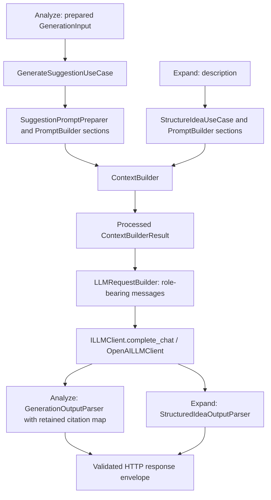

# LLM / Generation API implementation guide

**Source review:** 2026-10-07. This document covers Generation only. Retrieval, embeddings, reranking, storage, ingestion, and authentication implementations remain owned by their existing teams. Statements below describe verified code unless explicitly marked as a recommendation or gap.

> **Current working-tree issue:** The uncommitted `StructureIdeaPromptConfig.output_format` example uses Persian markers, but `IDEA_OUTPUT_MARKERS` and `StructuredIdeaOutputParser` still require the five English markers below. The pipeline is connected; a completion following that example fails parsing with HTTP 500 `GENERATION_FAILED`. This documentation update preserves the source edit. Restoring agreement with the original marker contract is a recommended Generation fix, not a change made here.

## 1. Implemented entry points

| HTTP route | Application orchestration | Successful result |
|---|---|---|
| `POST /api/v1/suggestions/analyze` | `AnalyzeSuggestionUseCase` hands prepared evidence to `IGenerateSuggestionUseCase` / `GenerateSuggestionUseCase` | Parsed model answer, cited suggestion IDs, uncertainty, and existing response metadata |
| `POST /api/v1/suggestions/expand-suggestion` | `IStructureIdeaUseCase` / `StructureIdeaUseCase` | Five fields parsed from the actual model completion |

Both routes use the shared `/api/v1` router, existing `X-API-Key` authentication, `X-Request-Id` tracing, Pydantic request models, constructor-injected application services, and `SuccessResponse` / `ErrorResponse` envelopes. The route module is [`suggestion.py`](../../src/presentation/routers/v1/suggestion.py). Expansion retains internal `StructureIdea*` names; `/structure-idea` is not the public route.



The existing Analyze no-evidence guard returns a diagnostic response before Generation when there are no hits or no active hydrated candidates. Expansion requires no retrieval input. Normal application startup still initializes the application's shared resources.

## 2. Expand Suggestion HTTP contract

The request is a flat JSON object, not wrapped in `data`:

```json
{"description": "Use temperature sensors to control transformer cooling fans."}
```

[`StructureIdeaRequest`](../../src/presentation/schemas/v1/structure_idea_request.py) requires a strict string, strips surrounding whitespace, rejects blank strings, and forbids extra fields. It converts to the immutable `StructureIdeaDTO(description: str)`. The use case checks nonblank input again and rejects more than **512 model tokens** using the same injected tokenizer as `ContextBuilder`. This limit is not 512 characters; the prompt budget and completion cap are separate limits.

An illustrative successful HTTP payload is:

```json
{
  "status": 200,
  "data": {
    "title": "Temperature-controlled cooling",
    "currentProblem": "Cooling fans are operated without temperature feedback.",
    "solution": "Use temperature sensors to control the fans.",
    "advantage": "Cooling can respond to actual demand.",
    "disadvantage": "Sensor reliability and installation costs need assessment."
  }
}
```

These are example values, not a recorded live completion. `StructuredIdeaResult.current_problem` becomes `currentProblem` in `StructuredIdeaDataResponse`; `solution` remains singular. Prompts and raw marked completions are not public response fields.

### Exact model-output contract

The parser requires this plain-text structure, with actual generated content replacing the example values:

```text
{title}
generated title
***
{current problem}
generated current problem
***
{solutions}
generated solutions
***
{advantage}
generated advantage
***
{disadvantage}
generated disadvantage
```

The code fence is for this documentation only. The model must emit no fence, JSON, Markdown heading, preamble, or epilogue. Each separator is exactly `***` on its own line. Markers are case-sensitive and ordered; `{solutions}` maps to the singular `solution` DTO/HTTP field. Persian instruction text and generated content do not authorize translating these machine-readable markers.

[`StructuredIdeaOutputParser`](../../src/infrastructure/services/llm/structured_idea_output_parser.py) normalizes CRLF, splits on `\n***\n`, requires five blocks and exactly four `***` occurrences, checks exact first-line markers and nonblank bodies, and rejects code fences, Markdown headings, and extra standalone `{...}` markers. It raises a typed error instead of repairing/reordering output. These are syntactic checks; arbitrary prose appended inside the final field is not independently detectable as an epilogue.

### Sections and processing

[`StructureIdeaPromptConfig`](../../src/application/prompt/structure_idea_prompt_config.py) is immutable configuration for static Persian instructions and explicit section tuning. System instructions treat the idea as untrusted data, request the idea's language, prohibit fabricated measurements/regulations/approvals/outcomes, and require uncertainty inside the relevant field. Check the marker mismatch noted above before expecting successful model output.

| Section, in order | Content | Demand | Importance | Explicit overflow stack |
|---|---|---:|---:|---|
| `SYSTEM-INPUT` | Static system instruction | 0.25 | 1.0 | `TRUNCATE`, restart false, max restarts 0 |
| `USER-INPUT` | Trimmed input description | 0.25 | 1.0 | `TRUNCATE`, restart false, max restarts 0 |
| `OUTPUT-FORMAT` | Static output instruction/example | 0.50 | 1.0 | `TRUNCATE`, restart false, max restarts 0 |

`StructureIdeaUseCase` creates fresh sections in `PromptBuilder(seed_defaults=False)`, calls the injected `ContextBuilder.build` with `IDEA_MAX_PROMPT_TOKENS`, then rejects any `SectionOutput.overflowed` with `PromptBudgetExceededError` before calling the LLM. ContextBuilder owns all fitting; the use case's guard preserves the accepted idea and essential instructions. It builds messages from the processed sections, awaits the shared LLM client, parses the returned completion, and returns the five fields. It never returns the constructed prompt as the successful result.

## 3. Analyze Suggestion Generation contract

[`AnalyzeSuggestionUseCase`](../../src/application/use_cases/analyze_suggestion_use_case.py) injects `IGenerateSuggestionUseCase` as `generator`. After prepared evidence exists, it builds `GenerationInput` and awaits `self._generator.execute(generation_input)`. The container supplies [`GenerateSuggestionUseCase`](../../src/application/use_cases/generate_suggestion_use_case.py), which runs `prepare_with_citations → build_messages → complete_chat → parse`. Upstream evidence preparation remains outside this guide.

The current DTOs in [`dtos.py`](../../src/application/dtos.py) are:

| DTO | Generation-relevant fields and validation |
|---|---|
| `CurrentSuggestionInput` | Required substantive `title`, `problem`, `solution`; optional `id`, `context_title`; `status` defaults to `PENDING`. There is no `date` field. |
| `SimilarSuggestionInput` | `id`, `title`, `problem`, `solution`, `status`, finite `similarity`; optional `context_title`, `reference`. Similarity is not restricted to [0, 1]. |
| `RegulationInput` | `id`, `title`, `content`, optional `citation`; accepted by the DTO but currently not rendered by the preparer. |
| `GenerationInput` | Current suggestion, ordered/validated similar suggestions with unique domain IDs, regulations defaulting to an empty list. |
| `PreparedGeneration` | Fitted `ContextBuilderResult` and direct retained `citation_id → original SimilarSuggestionInput` map. |
| `GenerationResult` | Validated `answer`, original cited items, optional `uncertainty`. |

The model-facing Analyze contract is **JSON**, independently of the expansion contract:

```json
{"answer": "Decision-support analysis text", "citations": ["[similar 001]"], "uncertainty": null}
```

`SuggestionAnalysisPromptConfig` contains Persian system/output instructions. The requested `answer` is a Persian Markdown analysis with four parts. [`GenerationOutputParser`](../../src/infrastructure/services/llm/output_parser.py) strips an optional surrounding code fence before JSON parsing, requires nonblank `answer` and a citations list, validates exact short citation syntax, resolves only retained IDs, deduplicates in first-seen order, and normalizes blank uncertainty to `None`. It does not enforce the expansion parser's plain-text restrictions or forbid all extra JSON keys.

The HTTP Generation fields are:

| External field | Verified meaning |
|---|---|
| `analysis` | `generation_result.answer` on the normal path; diagnostic text on the no-evidence path. |
| `citedSuggestionIds` | Unique original domain IDs from validated cited similar-suggestion objects, restricted to the active candidates. |
| `uncertainty` | Parsed model uncertainty, or an explicit evidence-gap message on the no-evidence path. |
| `groundingRatio` | Unique cited active IDs divided by all active candidate IDs, rounded to two decimals and bounded to [0, 1]. Coverage proxy, not calibrated model confidence. |
| `isFallbackMode` | Existing upstream fallback flag, not an LLM retry/fallback indicator. |
| `similarExecutedIds`, `similarApprovedIds`, `similarPendingIds`, `similarRejectedIds`, `similarNotAcceptedIds` | Existing candidate lists; their membership does not mean the model cited every listed suggestion. |
| `appliedStatuteIds` | Currently empty; regulation rendering and citation resolution remain missing. |

With no usable evidence, the use case returns HTTP 200 diagnostic analysis, empty ID lists, uncertainty, and grounding zero without invoking the generator. This is implemented policy; this update does not change it.

## 4. Prompt, context, references, and citation ownership

`PromptBuilder` owns the section registry, ordering, and concatenation using `SECTION_SEPARATOR`. `ContextBuilder` owns section preparation/reference enrichment, token counting, capacity allocation/redistribution, overflow dispatch, fitting, and the assembled result. Endpoint/use-case code must not reimplement these responsibilities.

`SuggestionPromptPreparer` orders `SYSTEM-INPUT → USER-INPUT → optional SIMILAR-SUGGESTIONS → OUTPUT-FORMAT`. It renders current title/context/problem/solution, reserves fixed text and separators using the injected tokenizer, computes fixed-section demand with importance 1.0, and assigns the remaining capacity to evidence with importance 0.1. It requires the full first ranked evidence item to fit or raises `InsufficientEvidenceBudgetError`. Actual allocation/fitting stays inside ContextBuilder. `SimilarSuggestionsSection` uses `IGNORE` to retain a whole-item prefix in the supplied order.

`ReferencedCollectionSection` assigns deterministic occurrence IDs such as `[similar 001]` or `[chunk 001]` and retains direct links to original objects. IDs are not reassigned after overflow. `citation_map_for(fitted_output)` excludes removed items; parser resolution must use that map rather than the pre-fit collection. Generic `ChunksSection` can summarize or ignore items; collection truncation currently leaves content unchanged. Summarization preserves the original citation/reference identity.

`DeterministicReferenceGenerator`, `LLMBaseReferenceGenerator`, `TemplateValidator`, and `ReferenceCache` implement reference enrichment. The cache is keyed by input shape for templates; LLM-based template generation uses bounded validation retries. Do not introduce an intermediate `source_id` citation layer or confuse template retries with final-answer retries.

## 5. Provider, DI, and lifecycle

[`LLMRequestBuilder`](../../src/application/llm/llm_request_builder.py) builds role-bearing chat messages from **processed** sections: `USER-INPUT` and `SIMILAR-SUGGESTIONS` contribute to the user message, history retains turn roles, and other instruction sections contribute to system content. It does not reconstruct a raw prompt from the request DTO.

`ILLMClient` exposes `complete_chat`, plus synchronous helper operations `complete` / `complete_many`. [`OpenAILLMClient`](../../src/infrastructure/services/llm/openai_llm_client.py) uses the injected OpenAI-compatible client and shared event-loop thread. `complete_many` tries the provider's batch endpoint and falls back on HTTP 404 to bounded concurrent requests. `BaseOpenAIService` translates provider errors; `LLMClientRegistry` pools clients. There is no separate expansion-only provider implementation.

All runtime collaborators are required constructor parameters typed against ports. Per-call builders/sections are prompt data, not service construction. The composition root is [`containers.py`](../../src/containers.py): shared tokenizer/context/request/client providers; `generate_suggestion_use_case`; and `structure_idea_prompt_config` (`Object`), `structured_idea_output_parser` (`Singleton`), `structure_idea_use_case` (`Factory`). The Analyze provider injects `generator=generate_suggestion_use_case`. Production lifespan initializes resources and wires routers; teardown closes client resources.

Use the interface's defining module if it is not exported in `interfaces.__all__`; `IOutputParser` is such a port. Do not resolve application dependencies manually from `app.state.container` or instantiate infrastructure adapters inside a use case.

## 6. Configuration and budget limits

Defaults are verified in [`settings.py`](../../src/infrastructure/configs/settings.py), not evidence that a server with these settings was deployed:

| Setting | Default / responsibility |
|---|---|
| `LLM_PROVIDER` | `vllm` |
| `LLM_MODEL` | `Qwen/Qwen2.5-7B-Instruct` |
| `VLLM_HOST`, `VLLM_PORT` | `localhost`, `8000`; base URL ends in `/v1` |
| `VLLM_API_KEY` | `EMPTY` for the local compatible provider |
| `LLM_TIMEOUT` | 60 seconds |
| `LLM_TEMPERATURE` | 0.2 |
| `LLM_MAX_TOKENS` | 4096 completion tokens |
| `IDEA_MAX_PROMPT_TOKENS` | 4096 rendered prompt tokens; must be positive |
| `SUGGESTION_ANALYSIS_MAX_PROMPT_TOKENS` | 4096, in `SuggestionAnalysisSettings`; Generation prompt limit only |
| `TOKENIZER_MODEL` | Repository-local `assets/tokenizers/Qwen2.5-7B-Instruct`; loaded with `local_files_only=True` |
| `MAX_RETRIES` | 2 OpenAI SDK retries; separate from semantic output validation |

`QwenTokenizer` wraps the injected fast tokenizer without automatic special tokens. `transformers`, `openai`, and `dependency-injector` are declared dependencies. Use a tokenizer compatible with the served model.

**Gap:** Rendered section budgets do not automatically reserve the complete chat-template framing and completion allowance against a model context-window setting. Recommendation: add this accounting at the existing Generation request boundary, preserving ContextBuilder's fitting responsibilities. Configured prompt and completion caps must fit the actual server's capacity; a successful historical 0.5B run does not validate the default 7B deployment.

## 7. Errors and observability

Both routes reuse the existing centralized HTTP mappings; malformed completions are not successful responses:

| Failure | HTTP / code |
|---|---|
| Missing expansion description | 422 `MISSING_REQUIRED_FIELD` |
| Blank/non-string/extra request fields, invalid or over-512-token idea | 422 `VALIDATION_ERROR`; idea errors point to `/data/description` |
| Essential prompt sections cannot fit | 422 `PROMPT_BUDGET_EXCEEDED` |
| Highest ranked evidence cannot fit | 422 `INSUFFICIENT_EVIDENCE_BUDGET` |
| Duplicate evidence ID | 422 `DUPLICATE_EVIDENCE_ID` |
| LLM configuration | 500 `LLM_CONFIGURATION_ERROR` |
| LLM connection/timeout | 503 `LLM_CONNECTION_FAILED` |
| LLM provider API error | 502 `LLM_API_ERROR` |
| Provider authentication | 401 `LLM_AUTH_FAILED` |
| Output parse/schema or invalid/unknown citation | 500 `GENERATION_FAILED` |
| Chunk summarization | 502 `LLM_SUMMARIZATION_FAILED` |

The existing default prompt-budget pointer is `/data/maxPromptTokens`, although expansion does not accept that request field; a server-configured budget can cause this error. Existing response/debug conventions are unchanged. See the [error dictionary](../contracts/05_Internal_Error_Codes.md) for exact exception names.

Expansion logs `idea_structuring_completed` with input/prompt token lengths, `length_unit=model_tokens`, and elapsed milliseconds, or `idea_structuring_failed` with LLM/parser error type and duration. That failure log wraps the LLM/parser call, not every earlier validation/budget failure. Source idea text and raw completion are not logged by this use case. Analyze logs its completed response metadata. Provider usage metrics, comprehensive Generation tracing, and a final malformed-output retry policy are not implemented as a unified standard; current final parsers fail immediately. SDK transport retries and reference-template retries are distinct.

## 8. Verified coverage and remaining work

Existing Generation tests cover parser contracts, injected collaborators, section ordering/fitting, citation preservation, chat transport/lifecycle, and error mappings. Expansion HTTP tests use the real application pipeline and local Qwen tokenizer with an OpenAI-compatible `httpx.MockTransport`; they do not initialize production lifespan or call a live model. Analyze presentation tests override its use case; unit tests verify the real generator handoff. See the [test summary](llm_generation_test_summary.md) for dated evidence and limitations.

Remaining Generation work includes fixing the working-tree marker disagreement, full model-context accounting, rendering/citing supplied regulations, defining invalid-output retries if required, and live HTTP-to-model validation. Mock-mode overrides currently do not replace `structure_idea_use_case`, while mock lifespan skips resource initialization; do not claim expansion has the same zero-dependency mock support as the existing five mocked use cases. Jinja files/custom persisted templates are planned alternatives; current static prompts are Python configuration dataclasses.

Recommendations are tracked in [next steps](../next_steps.md). Any upstream evidence-feed change must be reported to its owner; do not implement retrieval within Generation.
